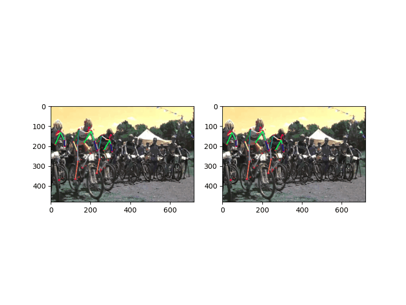
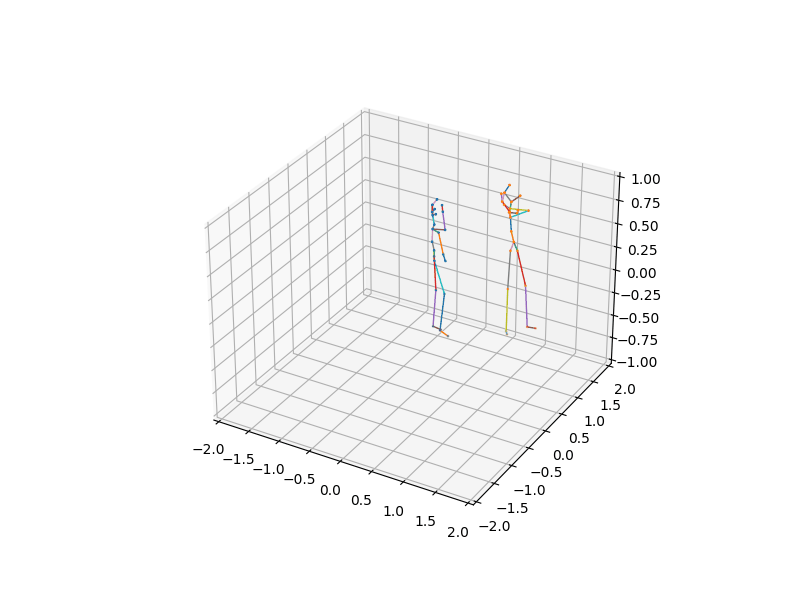

# Posepred  
Pospred is an open-source toolbox for pose prediction based on PyTorch. It is a part of the VitaLab project.    
<div class="row">
  <div class="column">
    
  </div>
  <div class="column">
    
  </div>
</div>
```
posepred
├── api
│   ├── evaluate.py                     -- script to evaluate
|   ├── predict.py                      -- script to predict 
|   ├── preprocess.py                   -- script to run preprocessor module
|   ├── train.py                        -- script to train models
|   └── visualize.py                    -- script to run visualization module
├── args
|   ├── evaluations_args                -- argument handler for evaluation
|   └── ...                             -- argument handler for other modules
├── dataloader
|   ├── data_loader.py                  -- simply returns appropriate dataloader
|   ├── interactive_dataset.py          -- handles dataloader for interactive data
|   └── non_interactive_dataset.py      -- handles dataloader for non-interactive data
├── factory
│   ├── evaluator.py                    -- base code for evaluation 
|   ├── predictor.py                    -- base code for testing
|   └── trainer.py                      -- base code for training
├── models
│   ├── decoder.py                      -- base code for decoder
|   ├── encoder.py                      -- base code for encoder
│   ├── disentangle1.py                 -- first disentangle model using pv_lstm structure
│   ├── neareset_neighbor.py            -- nearest neighbor model
|   ├── pv_lstml.py                     -- basic pv_lstm model
|   └── zero_vel.py                     -- basic zero velocity model
├── preprocessor
|   ├── preprocessor.py                 -- base class for preprocessor module
|   ├── dpw_preprocessor.py             -- preprocessing 3DPW dataset class
    └── ...                             -- other datasets preprocessor class
├── utils
|   ├── average_meter                   -- updating average for metrics each epoch
|   ├── losses.py                       -- available loss functions
|   ├── metrics.py                      -- available metrics
|   ├── reporter.py                     -- to calcualte and report losses and metrics
|   ├── save_load.py                    -- base code for saving and loading models
|   └── others.py                       -- other useful utils
|── visualization
|   ├── color_generator.py              -- code for generating miscellanoeus colors
|   ├── keypoints_connection.py         -- dictionary for creating joints connection graphs
|   └── visualizer.py                   -- base code for visualization
|── exps  
|   ├── train                           -- outputs of train time
|   ├── test                            -- outputs of test time (prediction)
|   └── visualize                       -- outputs for visualization
|
└── path_definition.py                  -- base code for constant useful paths 

```

## Installation  
To get started as quickly as possible, follow the instructions in this section. This should allow you train a model from scratch, evaluate your pretrained models, and produce basic visualizations.  
  
### Dependencies  
Make sure you have the following dependencies installed before proceeding:  
- Python 3.7+ distribution  
- PyTorch >= 1.7.0  
- CUDA >= 10.0.0  
### Virtualenv  
You can create and activate virtual environment like below:  
```bash  
virtualenv <venvname>  
  
source <venvname>/bin/activate  
```  
### Requirements  
Furthermore, you just have to install all the packages you need:  
  
```bash  
pip install -r requirements.txt  
```  
  
## Preprocessing  
We need to create clean static file to enhance dataloader and speed-up other parts.  
To fulfill mentioned purpose You should run preprocessing api called `preprocess.py` like below:  

Example:  
```bash  
python -m api.preprocess --dataset_name=<dataset_name> --official_annotation_path=<path_to_dataset> --data_usage='train' --obs_frames_num=16 --pred_frames_num=14 --use_mask  
```  
See [here](https://github.com/vita-epfl/posepred/blob/master/ARGS_README.md#preprocessing) for more details about preprocessing arguments.
  
## Training
Train models from scratch:
```bash  
python -m api.train --train_dataset=<dataset_name> --model=<model_name> --keypoint_dim=2 --epochs=100
```  
Provide **validation_dataset** to adjust learning-rate and report metrics on validation-dataset as well.

See [here](https://github.com/vita-epfl/posepred/blob/master/ARGS_README.md#training) for more details about training arguments.


## Evaluation
Evaluate pretrained model:
```bash  
python -m api.evaluate --dataset=<dataset_name> --model=<model_name> --keypoint_dim=2 --load_path=<path_to_model> 
```  
See [here](https://github.com/vita-epfl/posepred/blob/master/ARGS_README.md#evaluation) for more details about evaluation arguments.


## Prediction
Generate and save predicted future pose:
```bash  
python -m api.predict --dataset=<dataset_name> --model=<model_name> --keypoint_dim=2 --load_path=<path_to_model> 
```  
See [here](https://github.com/vita-epfl/posepred/blob/master/ARGS_README.md#prediction) for more details about prediction arguments.
  
  
## Visualization  
You can Visualize both 3D and 2D data with visualization module.  
See here for more details about visualization arguments. <br>
In order to generate .gif outputs you can run `visualize.py‍‍‍‍` like below:  
  
### 2D Visualization  
  
Example:  
```bash  
python -m api.visualize --dataset=<dataset_name> --model=<model_name> --keypoint_dim=2 --load_path=<path_to_model>
```  
  
Sample output:  
  
<div align="center">  
    <br>  
</div>  
  
### 3D Visualization  
  
If we have camera extrinsic and intrinsic parameters and image paths, we would create 2 gifs:  
- 2D overlay on images  
- 3D positions from the camera's POV  
  
Example:  
```bash  
python -m api.visualize --dataset=<dataset_name> --model=<model_name> --keypoint_dim=3 --load_path=<path_to_model>
```  
  
Sample outputs:  
<div align="center">  
   <!--  <br>  -->
      
</div>

see [here](https://github.com/vita-epfl/posepred/blob/master/ARGS_README.md#visualization) for more details about visualization arguments.
